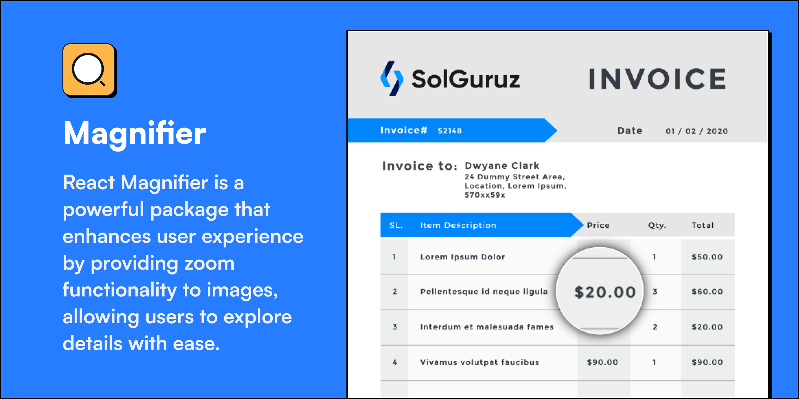
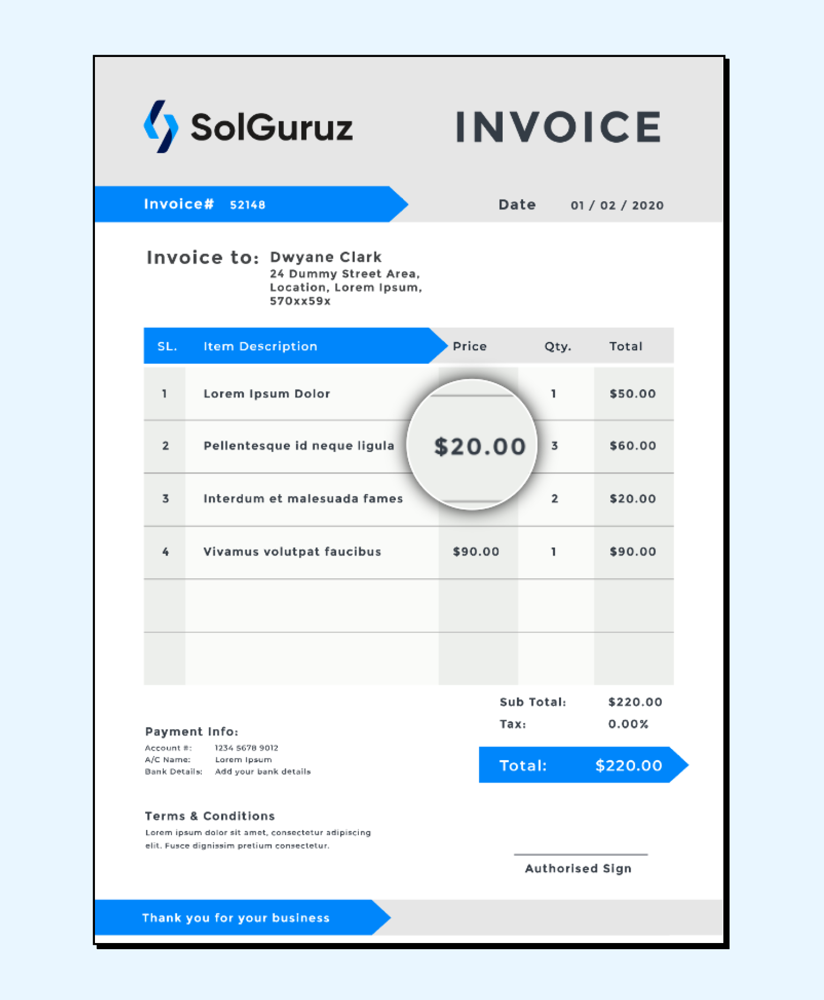

<div align='center'>
 
</div>

# React Magnifier

This is a low-level component for magnify in React.

## Features

- **Image Display:** Use an image component to display the image you want to magnify.

- **Magnified View:** Create a separate container to display the magnified portion of the image. You can use CSS to position and style this container, making it circular or any desired shape. The magnified view should update dynamically based on the mouse cursor position.

- **Zoom Level Control:** Add controls (such as buttons or sliders) to allow users to adjust the zoom level of the magnifier. These controls should modify the size of the magnified area accordingly.


## Screenshots




## Tech Stack

**Client:** React

## Getting Started

Clone the project

```bash
  git clone https://github.com/solguruz/magnifier-react.git
```

Go to the project directory

```bash
  cd magnifier-react
```

Install dependencies

```bash
  yarn install
```

## Configuration

| Parameters            | Type          | Default    | Description                                                                                                                                                      |
| ---------------- | ------------- | ---------- | ---------------------------------------------------------------------------------------------------------------------------------------------------------------- |
| `image` (required) | String        | –          | URL of the image                                                                                                                                      |
| `zoom`         | Number | 2   | it's define the zoom level of component                                          |
| `width`          | Number/String | `'100%'`   | Image width                                                                                                                |
| `magnifierWidth`      | Number        | `150`     | Width of the Magnifier                                                                                                       |
| `magnifierHeight`     | Number        | `150`         | Height of the magnifier                                                             |
| `borderWidth`     | Number        | `2`      | Border Width of the magnifier                                                                             |
| `borderColor`        | String        | `white`      | Color of magnifier border                                                                                                                              |


## Usage/Examples

```javascript
import { Magnifier } from 'solguruz-react-image-magnifier'

const App = () => {
  return <Magnifier image={IMAGE_PATH} />;
}
```

## 🚀 About Us

Engineering Quality Solutions by employing technologies with Passion and Love | Web and Mobile App Development Company in India and Canada

## 🔗 Links

<div align="left">
<a href="https://solguruz.com/" target="_blank">

</a>
<a href="https://www.facebook.com/SolGuruzHQ" target="_blank">

</a>

<a href="https://www.linkedin.com/company/solguruz/" target="_blank">

</a>
<a href="https://www.instagram.com/solguruz/" target="_blank">

</a>

<a href="https://twitter.com/SolGuruz" target="_blank">

</a>
<a href="https://www.behance.net/solguruz" target="_blank">

</a>
<a href="https://dribbble.com/SolGuruz" target="_blank">

</a>

</div>

## Contributing

Contributions are always welcome!

See `contributing.md` for ways to get started.

Please adhere to this project's `code of conduct`.

## License

```text
MIT License

Copyright (c) 2023 SolGuruz LLP

Permission is hereby granted, free of charge, to any person obtaining a copy
of this software and associated documentation files (the "Software"), to deal
in the Software without restriction, including without limitation the rights
to use, copy, modify, merge, publish, distribute, sublicense, and/or sell
copies of the Software, and to permit persons to whom the Software is
furnished to do so, subject to the following conditions:

The above copyright notice and this permission notice shall be included in all
copies or substantial portions of the Software.

THE SOFTWARE IS PROVIDED "AS IS", WITHOUT WARRANTY OF ANY KIND, EXPRESS OR
IMPLIED, INCLUDING BUT NOT LIMITED TO THE WARRANTIES OF MERCHANTABILITY,
FITNESS FOR A PARTICULAR PURPOSE AND NONINFRINGEMENT. IN NO EVENT SHALL THE
AUTHORS OR COPYRIGHT HOLDERS BE LIABLE FOR ANY CLAIM, DAMAGES OR OTHER
LIABILITY, WHETHER IN AN ACTION OF CONTRACT, TORT OR OTHERWISE, ARISING FROM,
OUT OF OR IN CONNECTION WITH THE SOFTWARE OR THE USE OR OTHER DEALINGS IN THE
SOFTWARE.
```